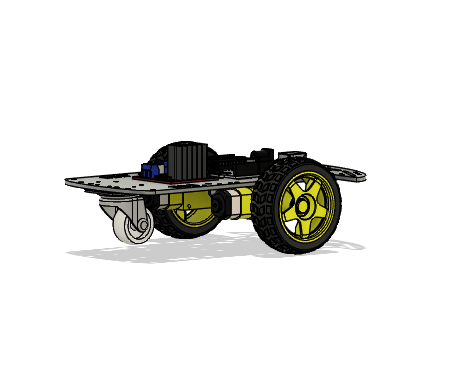
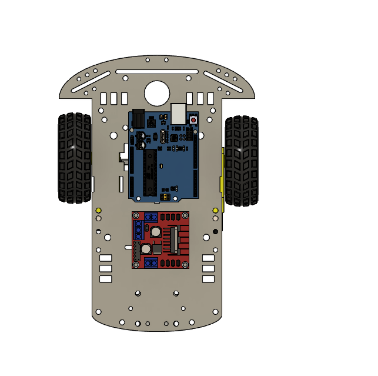
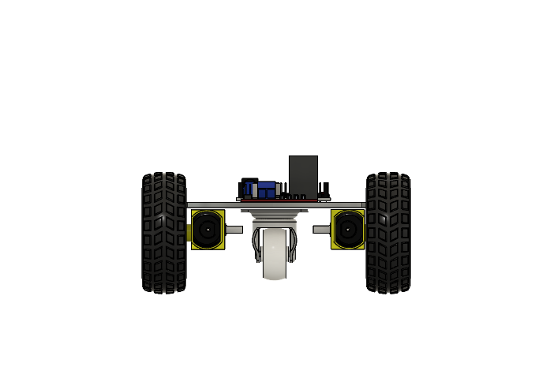
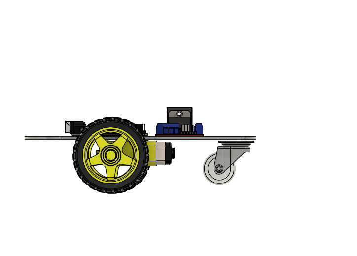
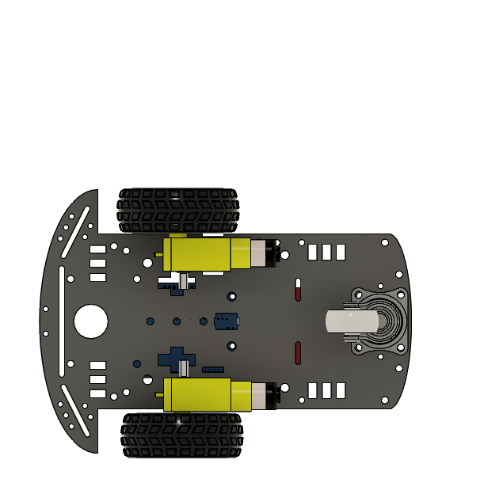
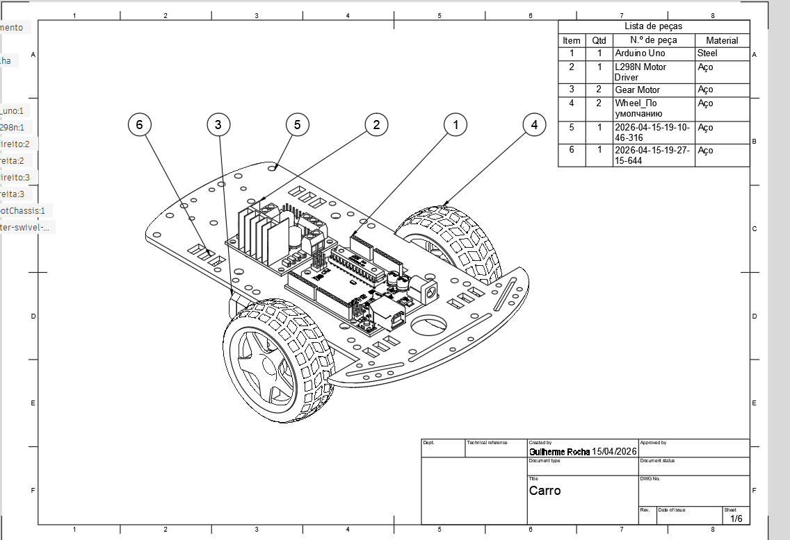
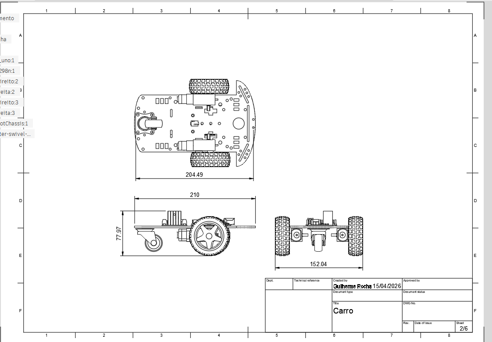
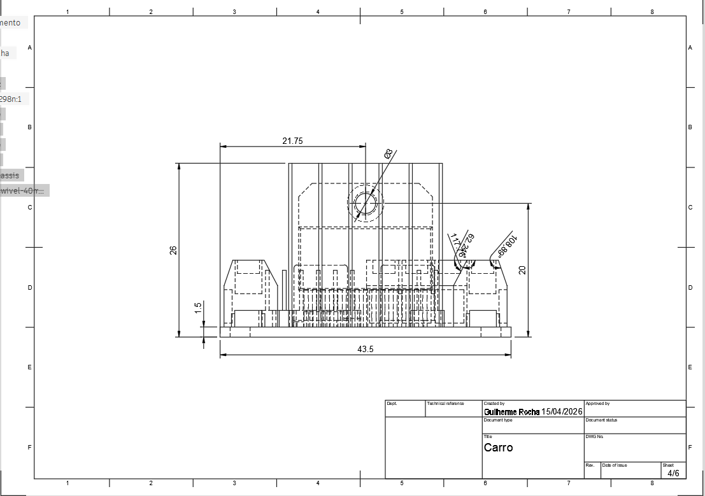
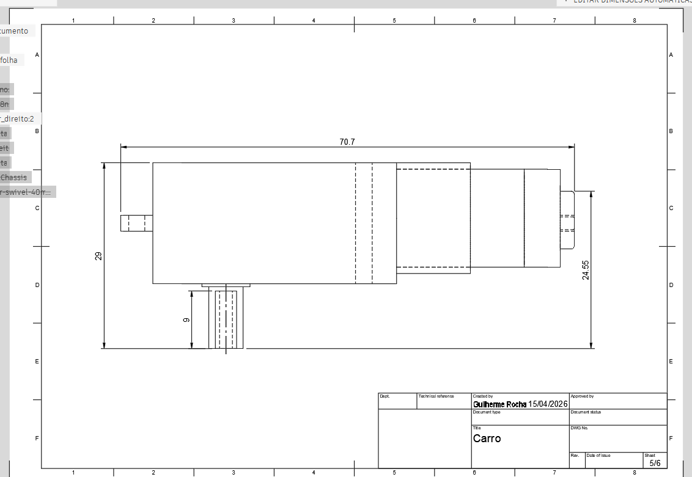
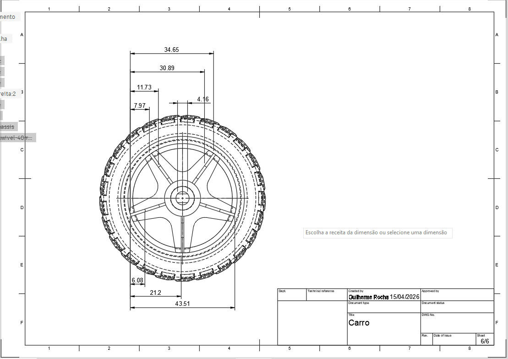

# Projeto Mecânico e Fabricação — Chassi do Carrinho-Robô

## Arquivo-fonte

- [`Carro.f3z`](Carro.f3z) — arquivo nativo do **Autodesk Fusion 360** com a
  modelagem 3D completa do chassi (peças + montagem/assembly).

> ⚠️ **`[PREENCHER]`**: falta exportar o **STL** do chassi (e das demais
> peças impressas, se houver) e adicioná-lo nesta pasta — por exemplo
> `chassi.stl`. No Fusion 360: botão direito na peça/corpo no navegador →
> **Save as Mesh** → formato STL.

## Lista de peças (BOM)

Conforme extraído do desenho técnico (sheet 1/6):

| Item | Qtd | Peça | Material |
| :---: | :---: | :--- | :--- |
| 1 | 1 | Arduino Uno *(protótipo — ver nota abaixo)* | — |
| 2 | 1 | L298N Motor Driver | — |
| 3 | 2 | Gear Motor (motor-redutor) | — |
| 4 | 2 | Wheel (roda) | — |
| 5 | 1 | Chassi (corpo impresso) | — |
| 6 | 1 | Suporte / roda giratória (caster) | — |

> **Nota de evolução do projeto:** a modelagem 3D original foi feita
> considerando um **Arduino Uno**, mas o firmware final (`src/codigo.ino`)
> foi implementado em **ESP32**, pela necessidade de comunicação Bluetooth
> nativa para o controle remoto sem fio. As dimensões da placa no chassi
> foram compatibilizadas (ver tabela dimensional em
> [`../hardware/README.md`](../hardware/README.md)). Esse tipo de decisão está
> registrado em [`../organizacao/Decisoes.md`](../organizacao/Decisoes.md).

## Renders 3D

| Vista | Imagem |
| :--- | :--- |
| Isométrica |  |
| Superior (posicionamento dos componentes) |  |
| Frontal |  |
| Lateral |  |
| Inferior (motores) |  |

## Desenhos técnicos cotados

Conjunto de desenhos técnicos gerados no Fusion 360 (autoria: Guilherme
Rocha, 15/04/2026), com a lista de peças e as principais cotas do chassi:

| Sheet | Conteúdo | Imagem |
| :---: | :--- | :--- |
| 1/6 | Lista de peças (BOM) + vista isométrica |  |
| 2/6 | Vistas (superior/frontal/lateral) com dimensões gerais (204.49 × 152.04 × 77.97 mm) |  |
| 4/6 | Detalhe frontal cotado |  |
| 5/6 | Detalhe do compartimento do motor |  |
| 6/6 | Detalhe da roda |  |

> Sheet 3/6 não foi capturado/exportado do Fusion 360. `[PREENCHER]` se a
> equipe quiser completar o conjunto.

## Registros de fabricação

`[PREENCHER]`: adicionar aqui fotos do processo de impressão 3D (ou do
processo de fabricação utilizado) do chassi — por exemplo, foto da peça
sendo impressa, foto da peça recém-impressa antes da montagem, e eventuais
ajustes/lixamento realizados. Ver também os testes de encaixe registrados em
[`../testes/TESTES.md`](../testes/TESTES.md).

## Versões e alterações do chassi

Ver histórico de decisões e evolução do projeto em
[`../organizacao/Decisoes.md`](../organizacao/Decisoes.md).
