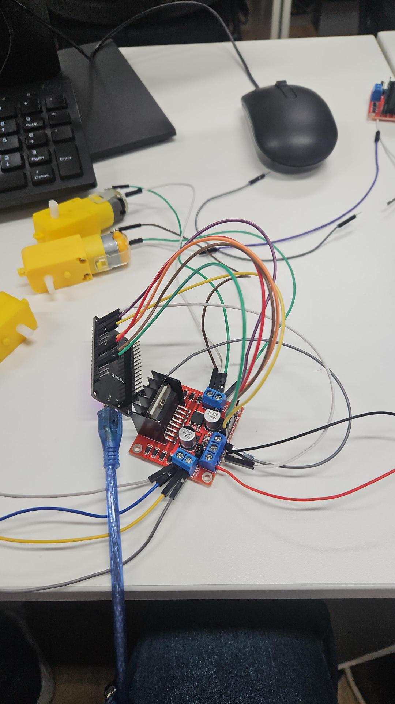

# Hardware e Eletrônica — Carrinho-Robô

## Lista de componentes

| Componente | Modelo/Tipo | Comprimento (cm) | Largura (cm) | Altura (cm) | Fixação |
| :--- | :--- | :---: | :---: | :---: | :--- |
| Microcontrolador | ESP32 | 6.91 | 5.08 | 1.16 | Parafuso |
| Motor esquerdo | Motor DC com caixa de redução (motor-redutor amarelo) | 6.41 | 1.96 | 2.15 | Parafuso |
| Motor direito | Motor DC com caixa de redução (motor-redutor amarelo) | 6.41 | 1.96 | 2.15 | Parafuso |
| Ponte H | L298N | 4.40 | 4.39 | 2.89 | Parafuso |
| Bateria | 2x células Li-ion 18650, em série (4.2V cada, carga plena) | 7.30 | 4.40 | 1.91 | Cola dupla-face |
| Sensor | Ultrassônico HC-SR04 | 4.42 | 1.92 | 1.39 | Cola quente |
| Roda livre | Caster (roda boba) | — | — | — | Parafuso |

> **Alimentação:** duas baterias de **4,2V** (célula Li-ion 18650 em carga
> plena) associadas **em série**, totalizando **8,4V** no pacote (tensão
> nominal 7,4V, já que a tensão nominal de uma 18650 é 3,7V/célula). Essa
> tensão alimenta diretamente o módulo L298N, que por sua vez aciona os
> motores.

## Microcontrolador

**ESP32** — escolhido por possuir Bluetooth e Wi-Fi integrados nativamente,
dispensando módulos de comunicação externos. É responsável por:
- ler os comandos recebidos via Bluetooth (app Dabble);
- acionar a ponte H para controlar os motores;
- ler o sensor ultrassônico e decidir quando parar o carrinho.

## Motores e Ponte H

- **Motores:** 2x motor DC com caixa de redução, tração diferencial (um motor
  de cada lado), permitindo curvas ao variar o sentido de rotação entre as
  rodas.
- **Ponte H:** módulo **L298N**, responsável por inverter a polaridade
  aplicada a cada motor (sentido horário/anti-horário) a partir dos sinais
  digitais enviados pelo ESP32.

### Mapeamento de pinos (ESP32 → L298N)

| Sinal | Pino ESP32 | Função no L298N |
| :--- | :---: | :--- |
| IN1 | GPIO 16 | Direção motor esquerdo (bobina A) |
| IN2 | GPIO 17 | Direção motor esquerdo (bobina B) |
| IN3 | GPIO 18 | Direção motor direito (bobina A) |
| IN4 | GPIO 19 | Direção motor direito (bobina B) |
| ENA | GPIO 5 | Habilita/velocidade motor esquerdo (fixo em HIGH = velocidade máxima) |
| ENB | GPIO 23 | Habilita/velocidade motor direito (fixo em HIGH = velocidade máxima) |

> No firmware atual, `ENA` e `ENB` são mantidos sempre em `HIGH`, ou seja, os
> motores operam sempre na velocidade máxima (sem controle de PWM). Uma
> melhoria futura seria usar `analogWrite`/`ledcWrite` nesses pinos para
> controlar a velocidade.

### Mapeamento de pinos (ESP32 → HC-SR04)

| Sinal | Pino ESP32 | Função |
| :--- | :---: | :--- |
| TRIG | GPIO 25 | Envia o pulso ultrassônico |
| ECHO | GPIO 26 | Recebe o eco e mede o tempo de retorno |

## Alimentação

- O pacote de **2 baterias 18650 em série (7,4V nominal / 8,4V em carga
  plena)** alimenta a entrada de potência (`12V`/`VCC`) do módulo L298N.
- O L298N possui um regulador linear onboard (5V) usado para alimentar a
  lógica interna da ponte; o ESP32 é alimentado a partir dessa mesma fonte de
  5V ou via USB durante o desenvolvimento — `[PREENCHER]` confirmar qual das
  duas opções foi adotada na montagem final.
- Os motores são alimentados diretamente pelas saídas `OUT1-OUT4` da ponte H.

## Sensor

**HC-SR04 (ultrassônico)** — mede a distância até obstáculos à frente do
carrinho. Está integrado ao software (ver [`src/README.md`](../src/README.md)):
quando o carrinho está avançando e o sensor detecta um obstáculo a **20 cm ou
menos**, o firmware interrompe automaticamente o acionamento dos motores,
evitando a colisão.

## Comunicação sem fio

**Bluetooth**, via biblioteca [DabbleESP32](https://thestempedia.com/docs/dabble/game-pad-module/)
e o módulo **Gamepad** do aplicativo **Dabble** (STEMpedia). O celular, com o
app Dabble instalado, conecta-se ao ESP32 por Bluetooth e envia os comandos
de direção (cima/baixo/esquerda/direita) que o firmware traduz em comandos
para a ponte H.

## Diagrama de conexões

```
                     ┌─────────────┐
      Bateria ──────►│   L298N     │
                     │  (Ponte H)  │
                     └──┬───┬──┬──┬┘
                 IN1/IN2│   │IN3/IN4
                  ENA   │   │   ENB
                        ▼   ▼
              ┌─────────┐ ┌─────────┐
              │  Motor  │ │  Motor  │
              │Esquerdo │ │ Direito │
              └─────────┘ └─────────┘

     ESP32 ── GPIO16,17,18,19,5,23 ──► L298N (direção/velocidade)
     ESP32 ── GPIO25 (TRIG) ────────► HC-SR04
     ESP32 ◄── GPIO26 (ECHO) ──────── HC-SR04
     ESP32 ◄──── Bluetooth (Dabble) ──── Smartphone
```

## Fotos da montagem

Os renders 3D do chassi e os desenhos técnicos cotados (usados para planejar
o posicionamento dos componentes antes da montagem física) estão
documentados em [`../cad/README.md`](../cad/README.md).

Montagem física do circuito de acionamento dos motores (Aula 16), com o
módulo L298N e os dois motores-redutores conectados para os primeiros testes
de bancada:



> `[PREENCHER]`: adicionar fotos da montagem final completa (chassi + ESP32 +
> L298N + bateria + sensor + carenagem) em [`../evidencias/`](../evidencias/EVIDENCIAS.md).
